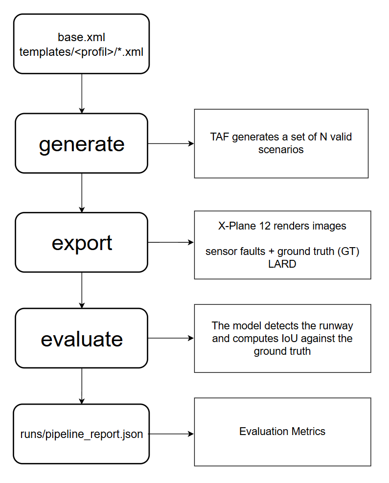

# LARDON

Outil de génération de **trajectoires d'approche réalistes aériennes** , rendues sous **X-Plane 12**, avec dégradation capteur et évaluation d'un
modèle de détection de piste.

L'outil échantillonne des scénarios sous contraintes avec **TAF** (Testing
Automation Framework, LAAS-CNRS), calcule les trajectoires d'approche et génère
les images correspondantes via X-Plane 12. Pour chaque image, il produit également
la **vérité terrain** — la position réelle de la piste projetée en 2D sur l'image
— à l'aide de **LARD** (ONERA, IRT Saint Exupéry et AIRBUS).

Sur ces images, un **modèle de détection** (choisi par l'utilisateur dans
`settings.xml`) prédit la position de la piste. Ces prédictions sont ensuite
comparées à la vérité terrain : la qualité de la détection est mesurée par l'**IoU**
(intersection sur union) entre prédiction et vérité terrain.

L'utilisateur n'a qu'à éditer des fichiers **XML** pour définir ses scénarios,
puis à lancer l'outil en ligne de commande. Deux notebooks
(`notebook/generation.ipynb` pour les 3 phases, `notebook/features.ipynb` pour
les outils annexes) sont également disponibles pour ceux qui préfèrent travailler
en interactif.

---

## Aperçu de l'outil



---

## Prérequis

| Composant   | Détail |
|-------------|--------|
| **OS**      | Compatible Windows et Linux. |
| **Python**  | Python 3.10.10. |
| **X-Plane 12** | Version **complète (payante)** obligatoire. Sinon, l'accès est limité à seulement quelques aéroports/pistes. Téléchargement : <https://www.x-plane.com/> |

---

## Installation

### 1. Cloner le projet

```bash
git clone https://gitlab.laas.fr/trust_ml_safety/LARDON
cd LARDON
```

### 2. Récupérer LARD

LARD n'est **pas** inclus dans le dépôt. Depuis la racine du projet :

```bash
git clone https://github.com/deel-ai/LARD
```

Le dossier `LARD/` doit se trouver à la racine, à côté de `sources/`.

> Vous avez déjà LARD installé ailleurs ? Inutile de le re-cloner : renseignez son
> chemin absolu dans `sources/settings.xml` via le paramètre `lard_dir`.

### 3. Récupérer TAF

TAF n'est **pas** inclus dans le dépôt. Depuis la racine du projet :

```bash
git clone https://redmine.laas.fr/laas/taf.git
```

*Plus de détails sur TAF : <https://wp.laas.fr/taf/download/>*

> Vous avez déjà TAF installé ailleurs ? Renseignez son chemin absolu dans
> `sources/settings.xml` via le paramètre `taf_dir`.

Après les étapes 1 à 3, la racine doit contenir :

```
ProjetLAASMonitoring/
├── sources/
├── scripts/
├── yolo/
├── XPlanePlugin/
├── notebook/
├── run_pipeline.py
└── docs/
    ├── requirements.txt
    └── requirements-eval.txt
```

### 4. Installer les dépendances Python

Les dépendances sont séparées en **deux batchs** pour ne pas imposer PyTorch

| Batch | Fichier | Phases couvertes |
|-------|---------|------------------|
| **base** | `docs/requirements.txt` | `generate` + `export` (rendu X-Plane, fautes capteur, vérité terrain LARD) |
| **eval** | `docs/requirements-eval.txt` | base **+** détection YOLO / IoU (Phase 3, tire PyTorch) |

```bash
# Créer l'environnement (une seule fois)
py -m venv .venv

# L'activer
.venv\Scripts\activate        # Windows (PowerShell / cmd)
source .venv/bin/activate     # Linux / macOS

# Installer le batch voulu
pip install -r docs/requirements.txt          # base : generate + export
pip install -r docs/requirements-eval.txt     # complet : + évaluation YOLO/IoU
```

> Installeur plus rapide ? Voir l'alternative **uv** :
> [docs/INSTALLATION_UV.md](docs/INSTALLATION_UV.md).

### 5. Installer le plugin météo dans X-Plane 12

Deux éléments distincts à installer :

1. **XPPython3** — le moteur de plugins Python pour X-Plane.
   Suivre la procédure officielle :

   > https://xppython3.readthedocs.io/en/latest/usage/installation_plugin.html

   Il s'installe dans : `X-Plane 12/Resources/plugins/`.

   *Note : l'API **XPLMWeather** utilisée par le plugin météo est intégrée à
   X-Plane 12 et exposée directement par XPPython3 — rien à télécharger en plus.*

2. **PI_weather.py** — le plugin météo de ce projet. Un script l'installe au bon
   endroit (et crée le dossier `PythonPlugins/` si nécessaire) :

   ```bash
   py scripts/install_weather_plugin.py
   ```

   Le script lit `xplane_dir` depuis `sources/settings.xml`.
   *(Installation manuelle équivalente : créer le dossier
   `X-Plane 12/Resources/plugins/PythonPlugins/` puis y copier
   `XPlanePlugin/PI_weather.py`.)*

Puis **recharger les scripts depuis le simulateur** : une fois X-Plane 12 lancé,
utiliser la barre de menu en haut de la fenêtre du simulateur après avoir lancé le simulateur sur une piste aléatoire :
**Plugins → XPPython3 → Reload Scripts**.

---

## Configuration de X-Plane 12

- Lancer X-Plane 12 en **mode fenêtré** (pas en plein écran). Le réglage se fait
  dans les paramètres d'affichage du simulateur. Les captures sont prises
  directement sur la fenêtre du simulateur : **laisser l'écran allumé** et la
  fenêtre X-Plane visible pendant tout le rendu (ne pas la minimiser ni la
  recouvrir d'une autre fenêtre).
- Régler la **mise à l'échelle de l'affichage (scaling) à 100 % sur l'OS (Windows ou Linux)**.
  La capture est ensuite recadrée à une résolution fixe. Si le scaling de l'OS
  n'est pas à 100 %, les pixels capturés ne correspondent plus aux coordonnées
  attendues : la **bounding box de la vérité terrain (GT LARD)** se retrouve
  décalée par rapport à la piste.

---

## Configurer un scénario : les fichiers XML

C'est la seule partie à éditer pour définir ses propres scénarios.

### Choisir le profil actif — `sources/settings.xml`

```xml
<parameter name="template_path"      type="path" value="templates/rain/" />
<parameter name="template_file_name" type="file" value="rain_heavy.xml" />
```

- `template_path` + `template_file_name` : le template XML utilisé pour la génération.

### Templates pré-générées

- `sources/templates/base.xml` — template de base (trajectoire + météo + 26 fautes).
- `sources/templates/<profil>/*.xml` — variantes météo pré-générées, profils
  `clear`, `fog`, `clouds`, `rain`, `snow`, chacun en intensités
  *light / moderate / heavy*.

### Générer ou ajouter des templates

Les variantes météo sont produites par un script de *build* à partir de `base.xml`
et d'une table de presets. Pour les régénérer (par exemple après modification de
`base.xml`) ou pour ajouter un nouveau profil :

```bash
py scripts/build_weather_templates.py
```

Pour **ajouter un scénario / dossier**, éditer la table `PRESETS` dans
`scripts/build_weather_templates.py` (clé `(sous_dossier, nom_fichier)` →
surcharges des paramètres météo), puis relancer le script : il (re)crée les XML
correspondants dans `sources/templates/<profil>/`. Les fichiers générés ne
doivent **pas** être édités à la main — ils seront écrasés au prochain build.

### Explication des templates

Un template décrit, en un seul XML, l'ensemble des contraintes d'un scénario :
trajectoire, météo, réglages de rendu et fautes capteur. TAF lit ces contraintes
et échantillonne des valeurs concrètes (via le solveur z3).

#### Convention min / max

Chaque paramètre a un `min` et un `max` :

- `min` et `max` **identiques** → valeur fixe.
- `min` et `max` **différents** → TAF échantillonne une valeur dans la plage
  (résolution sous contraintes par le solveur z3).

#### Les 4 blocs d'un template

Chaque variable est commentée directement dans le XML (`base.xml`) — se référer
à ces commentaires pour le détail de chaque paramètre.

| Bloc | Variables |
|------|-----------|
| **trajectory** | `fps`, `along_track_distance_start`, `along_track_distance_end`, `ground_speed_kts`, `turbulence_intensity`, `wind_speed_kts`, `wind_direction_deg`, `stabilization_distance_m`, `airport_runway`. |
| **weather** | `precip_rate`, `cloud_type`, `cloud_coverage`, `cloud_thickness_m`, `fog_visibility`, `temperature_c`, `rain_scale`, `cloud_margin_m`, `weather_effect_duration`. |
| **settings** | `time_of_day_h`, `load_texture_duration`, `screenshot_duration`, `weather_zone_radius_nm`. |
| **faults** | 26 types de fautes capteur. Chaque faute a `severity`, `start_pct`, `duration_pct`. Une faute est **active si `severity > 0`**, désactivée si `severity = 0`. |

#### Piste cible

Le paramètre `airport_runway` utilise le format `ICAO_RWY` (exemple : `LFPO_24`,
`KPDX_10L`). La liste des pistes disponibles se trouve dans :
`LARD/data/runways_db_V2_XPlane.json`.

---

## Lancer l'outil

```bash
# Phase 1 — génère les scénarios (.yaml + poses caméra) dans runs/generation_01/
py run_pipeline.py generate -n 5

# Phase 2 — rendu X-Plane + fautes capteur + vérité terrain LARD
py run_pipeline.py export --all --generation generation_01

# Phase 3 — détection + calcul IoU vs vérité terrain
py run_pipeline.py evaluate --all --generation generation_01

# Tout enchaîner d'un coup (cycle complet avec évaluation)
py run_pipeline.py full_evaluate -n 5
```

**Pour une utilisation normale, la commande `full_evaluate` suffit** : elle
enchaîne les trois phases en une seule invocation. La commande `full`, elle,
n'enchaîne **que** la génération et le rendu (Phases 1 + 2, sans évaluation). Les
commandes `generate` / `export` / `evaluate` restent disponibles pour relancer
une phase précise.

> En mode `--all`, l'option `--generation <nom>` est obligatoire (elle évite de
> mélanger plusieurs batchs). Pour cibler un seul scénario, utiliser le chemin
> composé, ex. `export generation_01/LFPO_24`.

**Référence complète des commandes** (toutes les sous-commandes, toutes les
options, workflows types et équivalents notebook) : voir
[COMMANDES.md](docs/COMMANDES.md).

Le chemin d'installation X-Plane 12 est renseigné une seule fois dans
`sources/settings.xml` via le paramètre `xplane_dir` :

```xml
<parameter name="xplane_dir" type="path" value="C:/X-Plane 12" />
```

Les commandes le lisent automatiquement : **l'option `--xplane-dir` en ligne de
commande n'est donc pas nécessaire** (elle ne sert qu'à surcharger ponctuellement
ce chemin). Ce répertoire n'est utilisé que pour localiser le plugin météo ; le
positionnement et la capture d'images n'en dépendent pas.

---

## Résultats

Chaque génération (batch) produit un dossier dans `runs/`, avec un sous-dossier
par scénario (`<ICAO_RWY>`) :

```
runs/
└── generation_01/                  un batch (--name pour personnaliser)
    ├── LFPO_24/                     un dossier par scénario (format ICAO_RWY)
    │   ├── LFPO_24.yaml             scénario généré (Phase 1)
    │   ├── poses_cam_export.json    poses caméra
    │   ├── fault_profile.json       profil fautes capteur (si actif)
    │   ├── weather_profile.json     profil météo X-Plane (si actif)
    │   ├── footage/                 images rendues par X-Plane
    │   ├── degraded/                images avec fautes capteur (si actives)
    │   ├── LFPO_24_labels.csv       vérité terrain LARD
    │   ├── predictions.csv          détections du modèle
    │   └── predictions_txt/         labels bruts du modèle
    └── pipeline_report.json         rapport agrégé : IoU, AP, F1, P, R par scénario
```

### Aller plus loin avec les notebooks

Deux notebooks dans le dossier `notebook/` :

- **`notebook/generation.ipynb`** — reproduit les **trois phases de l'outil**
  (`generate`, `export`, `evaluate`), exécutables séparément depuis ses cellules,
  sans passer par la ligne de commande. Alternative complète au CLI.
- **`notebook/features.ipynb`** — fonctionnalités complémentaires, à la demande :
  - création de **datasets** à partir des images générées,
  - assemblage des images d'un scénario en **flux vidéo**,
  - export de **fichiers optionnels** (`params_trace.xml`, `xplane_config.json`),
  - **visualisations des bounding boxes** (`yolo_box/`, `lard_box/`) pour comparer
    prédictions du modèle et vérité terrain LARD.
